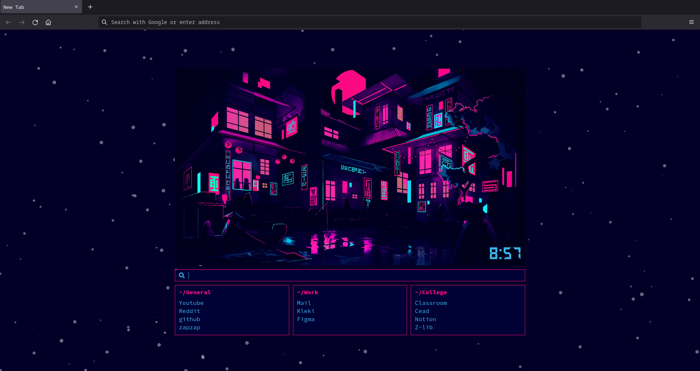

# Homepage

My custom home/newTab page using basic html, css and JS




<!-- GETTING STARTED -->
## Getting Started

### Firefox

#### HomePage

1. Click the menu button and select Settings.
2. Click the Home panel.
3. Click the menu next to Homepage and new windows and choose to show custom URLs. 
4. paste the index.html path ```file:////path/to/folder/index.html``` 

#### NewTab

To set this page as your new tab youll have to go to your Firefox installation directory and chage your preferences (It is a method 
that, as per the Mozilla support, is used to automatically change user preferences or prevent the end user from modifying specific preferences)

first enable the AutoConfig file. In recent versions sandbox is required to be disabled in order to access local files.

/usr/lib/firefox/defaults/pref/autoconfig.js
```
pref("general.config.filename", "firefox.cfg");
pref("general.config.obscure_value", 0);
pref("general.config.sandbox_enabled", false);
``` 
The configuration file is actually a superset of pref files such as the one above. It overrides the AboutNewTab.jsm service with a custom local file.

/usr/lib/firefox/firefox.cfg
```
// skip line -- required comment
var { classes:Cc, interfaces:Ci, utils:Cu } = Components;
try {
  Cu.import("resource:///modules/AboutNewTab.jsm");
  AboutNewTab.newTabURL = "file:///path/to/folder/index.html";
} catch (e) {
  Cu.reportError(e);
}
```
